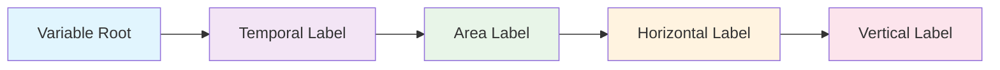

# What is a Branded Identifier?

## Definition

A **Branded Identifier** is a unique, structured name that completely describes a climate variable by combining standardized components into a single, unambiguous identifier.


**Climate variables** Examples

| Vague Description | Branded Identifier | 
|-------------------|-------------------|
| "Surface temperature" | `tas_tavg-h2m-hxy-u` | 
| "Ocean temperature" | `tos_tavg-u-hxy-sea` |

## Structure Preview

Every branded identifier follows this pattern:



## Real Example Breakdown

### `tas_tavg-h2m-hxy-u`

```
tas     _tavg  -h2m  -hxy         -u
│        │      │     │            │
│        │      │     │            └── Vertical: Surface/unspecified
│        │      │     └────────────── Horizontal: Gridded lat-lon
│        │      └──────────────────── Area: 2-meter height
│        └─────────────────────────── Temporal: Time average
└──────────────────────────────────── Root: Near-surface air temperature
```

**Result**: *"Near-surface air temperature, time-averaged, at 2-meter height, on a gridded horizontal grid, at the surface"*

## 🔑 Key Benefits of Standardized Variable Identifiers

| Benefit            | Description                                                                 |
|--------------------|-----------------------------------------------------------------------------|
| 🎯 **Uniqueness**   | - No two variables can have the same identifier<br>- Eliminates confusion between similar variables |
| 📖 **Self-Documenting** | - The identifier tells you what the variable represents<br>- No need to look up additional metadata |
| 🔧 **Machine-Readable** | - Computers can parse and validate identifiers<br>- Automatic error detection |
| 🌐 **Standardized**     | - Works across different models and institutions<br>- International collaboration made easier |


## Next Steps

Now that you understand what branded identifiers are, let's learn:

1. **[How to construct them →](02-how-to-construct.md)**
2. **[Where to find valid components →](03-component-reference.md)**
3. **[Why we need this system →](04-why-we-need-this.md)**

---

*Think of branded identifiers as the "scientific names" for climate variables - precise, unambiguous, and universally understood.*