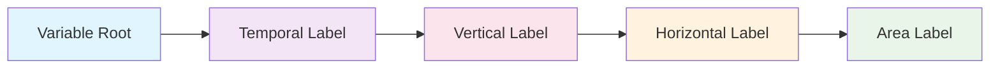

# What is a Branded Identifier?

## Definition

A **Branded Identifier** is a unique, structured name that completely describes a climate variable by combining standardized components into a single, unambiguous identifier.

## Structure

Every branded identifier follows this pattern:

```
[root-variable]_[temporal-label]-[vertical-label]-[horizontal-label]-[area-label]
```



## Real Examples

| Vague Description | Branded Identifier | Meaning |
|-------------------|-------------------|---------|
| "Surface temperature" | `tas_tavg-h2m-hxy-u` | Near-surface air temperature, time-averaged, at 2m height, gridded, unmasked |
| "Ocean temperature" | `tos_tavg-u-hxy-sea` | Sea surface temperature, time-averaged, unspecified vertical, gridded, over sea |
| "Heat flux" | `hfds_tavg-u-hxy-sea` | Downward heat flux, time-averaged, surface, gridded, over sea |

## Example Breakdown: `hfds_tavg-u-hxy-sea`

```
hfds    _tavg  -u    -hxy         -sea
│        │      │     │            │
│        │      │     │            └── Area: Ocean/sea areas only
│        │      │     └────────────── Horizontal: Gridded lat-lon
│        │      └──────────────────── Vertical: Surface/unspecified
│        └─────────────────────────── Temporal: Time average
└──────────────────────────────────── Root: Downward heat flux at sea surface
```

**Result**: *"Downward heat flux at sea surface, time-averaged, at surface level, on a gridded grid, over ocean areas"*

## 🔑 Key Benefits

| Benefit | Description |
|---------| ------------|
| 🎯 **Unique** | No two variables can have the same identifier |
| 📖 **Self-Documenting** | The identifier tells you what the variable represents |
| 🔧 **Machine-Readable** | Computers can parse and validate identifiers |
| 🌐 **Standardized** | Works across different models and institutions |

## Interactive Explorer

Build and explore identifiers with the [Variable Registry Explorer](../web/branded-variable-builder.html).

Try with a complete example: [hfds_tavg-u-hxy-sea](../web/branded-variable-builder.html?branding=hfds_tavg-u-hxy-sea)

## Next Steps

1. **[How to construct them →](02_How%20to%20Construct/01_general_structure.md)**
2. **[See examples →](02_How%20to%20Construct/examples.md)**
3. **[Why we need this system →](04-why-we-need-this.md)**

---

*Construction pattern: root_temporal-vertical-horizontal-area*
