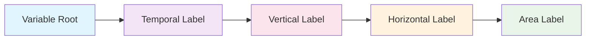

# How to Construct a Branded Identifier

## The Construction Formula

Every branded identifier follows this **exact pattern**:

```
[root-variable]_[temporal-label]-[vertical-label]-[horizontal-label]-[area-label]
```



## Step-by-Step Construction

### Example: Building `hfds_tavg-u-hxy-sea`

**Scenario**: You need downward heat flux at the sea surface for ocean energy studies.

#### Step 1: Choose Variable Root 🌱
- **Question**: What are you measuring?
- **Answer**: Downward heat flux at sea surface
- **Choice**: `hfds`

#### Step 2: Define Temporal Aggregation ⏰
- **Question**: How is data sampled in time?
- **Answer**: Time-averaged values
- **Choice**: `tavg`

#### Step 3: Define Vertical Coordinate 📏
- **Question**: What vertical level?
- **Answer**: Surface level (unspecified vertical dimension)
- **Choice**: `u`

#### Step 4: Choose Horizontal Representation 📊
- **Question**: How is data distributed spatially?
- **Answer**: Regular latitude-longitude grid
- **Choice**: `hxy`

#### Step 5: Specify Spatial Domain 🗺️
- **Question**: What area does this cover?
- **Answer**: Sea/ocean areas only
- **Choice**: `sea`

#### Assembly
```
hfds + _ + tavg + - + u + - + hxy + - + sea
= hfds_tavg-u-hxy-sea
```

## 🧩 Component Guide

=== "Step 1: Variable Root 🌱"

    **Choose the main physical quantity you're measuring.**

    ```yaml
    # Common Examples
    tas: Near-surface air temperature
    tos: Sea surface temperature  
    pr: Precipitation rate
    hfds: Downward heat flux
    ua: Eastward wind
    va: Northward wind
    ```

=== "Step 2: Temporal ⏰"

    **How is the data sampled over time?**

    ```yaml
    tavg: Time average (most common)
    tmax: Maximum value in period
    tmin: Minimum value in period  
    tpt: Snapshot/instantaneous
    tsum: Sum over time period
    ```

=== "Step 3: Vertical 📏"

    **What vertical level or dimension?**

    ```yaml
    u: Surface/unspecified
    h2m: 2 meters above ground
    al: All atmospheric levels
    ol: All ocean levels
    ```

=== "Step 4: Horizontal 📊"

    **How is data distributed spatially?**

    ```yaml
    hxy: Regular lat-lon grid (most common)
    hm: Global mean
    hy: Zonal mean
    ```

=== "Step 5: Area 🗺️"

    **What spatial domain/masking?**

    ```yaml
    u: Global/unmasked
    sea: Ocean areas only
    lnd: Land areas only
    air: Atmospheric region
    ```

## Quick Reference

| Component | Separator | Example |
|-----------|-----------|---------|
| Variable Root | `_` | `hfds_` |
| Temporal Label | `-` | `tavg-` |
| Vertical Label | `-` | `u-` |
| Horizontal Label | `-` | `hxy-` |
| Area Label | (end) | `sea` |

**Final Result**: `hfds_tavg-u-hxy-sea`

## Interactive Explorer

Use the [Variable Registry Explorer](../../web/branded-variable-builder.html) to build and validate your identifiers interactively.

## Next Steps

- **[See construction examples →](examples.md)**
- **[Learn common patterns →](patterns.md)**  
- **[Find valid components →](../08_components/)**

---

*Construction follows the pattern: root_temporal-vertical-horizontal-area with area going last.*
