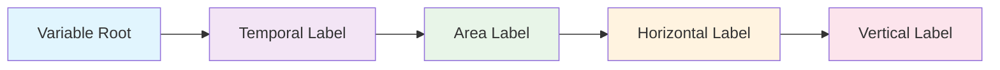
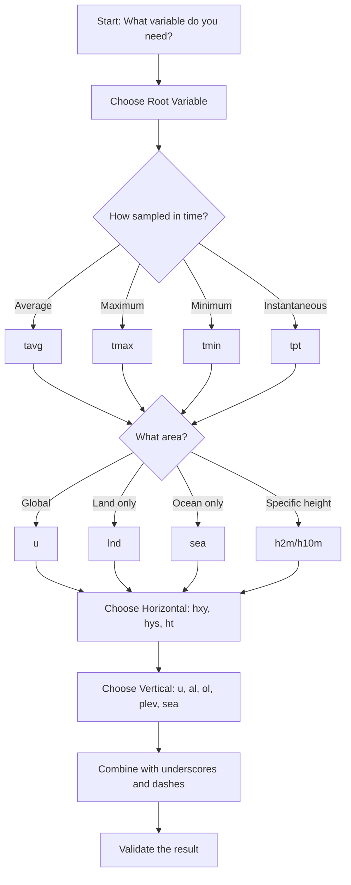

# How to Construct a Branded Identifier

## The Construction Formula

Every branded identifier follows this **exact pattern**:

```
[root-variable]_[temporal-label]-[area-label]-[horizontal-label]-[vertical-label]
```



## Step-by-Step Construction Walkthrough

### Example: Building `pr_tmax-lnd-hxy-u`

**Scenario**: You need daily maximum precipitation over land areas for flood risk assessment.

#### Step 1: Choose Variable Root 🌱
- **Question**: What are you measuring?
- **Answer**: Precipitation rate
- **Choice**: `pr`

#### Step 2: Define Temporal Aggregation ⏰
- **Question**: How is data sampled in time?
- **Answer**: Daily maximum values
- **Choice**: `tmax`

#### Step 3: Specify Spatial Domain 🗺️
- **Question**: What area does this cover?
- **Answer**: Land areas only (floods happen on land)
- **Choice**: `lnd`

#### Step 4: Choose Horizontal Representation 📊
- **Question**: How is data distributed spatially?
- **Answer**: Regular latitude-longitude grid
- **Choice**: `hxy`

#### Step 5: Define Vertical Coordinate 📏
- **Question**: What vertical level?
- **Answer**: Surface precipitation (no vertical dimension)
- **Choice**: `u`

#### Assembly
```
pr + _ + tmax + - + lnd + - + hxy + - + u
= pr_tmax-lnd-hxy-u
```


## 🧩 How to Build a Variable Identifier

Follow these 5 simple steps to create a clear, standardized variable name.

=== "Step 1: Core Variable 🌱"

    **Start with the main physical quantity you're describing.**

    Choose the fundamental parameter that represents what you're measuring:

    ```yaml
    # Common Variable Roots
    tas: Air temperature near the surface
    pr: Rainfall/precipitation rate  
    tos: Sea surface temperature
    abs550aer: Aerosol absorption at 550nm
    ua: Eastward wind component
    va: Northward wind component
    ps: Surface air pressure
    hurs: Near-surface relative humidity
    ```

    **Examples:**
    - For temperature measurements → `tas`
    - For rainfall data → `pr` 
    - For wind measurements → `ua` or `va`
    - For pressure data → `ps`

=== "Step 2: Time Info ⏰"

    **Describe how the data is sampled over time.**

    Specify the temporal aggregation or sampling method:

    ```yaml
    # Temporal Labels
    tavg: Average over time (monthly mean, daily mean)
    tmax: Maximum value in a time period
    tmin: Minimum value in a time period  
    tpt: Snapshot at a specific time (instantaneous)
    tsum: Sum over time period
    ```

    **Usage Guide:**
    - Climate normals → `tavg`
    - Extreme values → `tmax` or `tmin`
    - Weather forecasts → `tpt`
    - Accumulated quantities → `tsum`

=== "Step 3: Define Area 🗺️"

    **Specify where the data applies spatially.**

    Choose the spatial domain or masking:

    ```yaml
    # Area Labels  
    u: Global coverage (no mask)
    lnd: Land areas only
    sea: Ocean/sea areas only
    ice: Ice-covered areas only
    h2m: 2 meters above ground
    h10m: 10 meters above ground
    h100m: 100 meters above ground
    ```

    **Decision Tree:**
    - Global studies → `u`
    - Land-only analysis → `lnd`
    - Ocean research → `sea`
    - Near-surface weather → `h2m` or `h10m`

=== "Step 4: Horizontal Layout 📊"

    **Explain how the data is distributed horizontally.**

    Define the spatial representation:

    ```yaml
    # Horizontal Labels
    hxy: Regular grid (latitude-longitude)
    hys: Meridional section (latitude-depth slice)
    ht: Transect along a specific path
    hm: Global mean (no spatial dimension)
    ```

    **Common Uses:**
    - Global climate models → `hxy`
    - Ocean sections → `hys`  
    - Ship/aircraft tracks → `ht`
    - Global averages → `hm`

=== "Step 5: Vertical Level 📏"

    **Indicate the vertical dimension of the data.**

    Specify the vertical coordinate system:

    ```yaml
    # Vertical Labels
    u: Surface or unspecified vertical dimension
    al: All atmospheric levels (full 3D atmosphere)
    ol: All ocean levels (full 3D ocean)
    plev: Standard pressure levels
    sea: Sea surface or ocean-specific
    air: Atmospheric levels
    lnd: Land surface
    ```

    **Selection Guide:**
    - Surface variables → `u`
    - 3D atmospheric data → `al` or `plev`
    - 3D ocean data → `ol` or `sea`
    - Land surface only → `lnd`

## Visual Construction Guide



## Interactive Construction

**Try building your own:**

1. **What physical parameter?** → Choose from [root variables](../05-root-variables.md)
2. **How sampled in time?** → Choose from [temporal labels](../03-component-reference.md#temporal-labels)  
3. **What spatial area?** → Choose from [area labels](../03-component-reference.md#area-labels)
4. **Horizontal distribution?** → Choose from [horizontal labels](../03-component-reference.md#horizontal-labels)
5. **Vertical coordinate?** → Choose from [vertical labels](../03-component-reference.md#vertical-labels)

## Construction Resources

Explore detailed guidance for each aspect of construction:

### 📚 **[Construction Examples →](examples.md)**
Step-by-step examples organized by domain (atmospheric, ocean, land, precipitation)

### 🎯 **[Common Patterns →](patterns.md)**  
Standard patterns for different variable types and naming conventions

### ✅ **[Rules & Validation →](rules-and-validation.md)**
Construction rules, validation checklist, and error prevention

### 🔧 **[Validation Checklist →](checklist.md)**
Interactive checklist to validate your constructed identifiers

## Quick Reference

| Component | Separator | Example |
|-----------|-----------|---------|
| Variable Root | `_` | `tas_` |
| Temporal Label | `-` | `tavg-` |
| Area Label | `-` | `h2m-` |
| Horizontal Label | `-` | `hxy-` |
| Vertical Label | (end) | `u` |

**Final Result**: `tas_tavg-h2m-hxy-u`

## Next Steps

- **[See construction examples →](examples.md)**
- **[Learn common patterns →](patterns.md)**  
- **[Validate your identifier →](rules-and-validation.md)**
- **[Find valid components →](../03-component-reference.md)**

---

*Remember: Construction is systematic and rule-based. Follow the formula, check physical consistency, and validate against available components.*