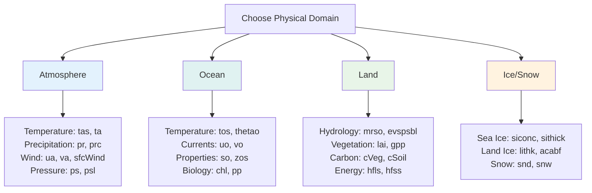

# Root Variables Overview 🌱

**Root variables** are the fundamental physical parameters that form the foundation of every branded identifier. They represent the core "what" of any climate variable.

[Browse All Root Variables on GitHub](https://github.com/WCRP-CMIP/Variable-Registry/tree/main/src-data/variable-root){ .md-button .md-button--primary }

## What are Root Variables?

Root variables define the basic physical quantity being measured or modeled, without any temporal, spatial, or dimensional qualifiers. They answer the fundamental question: *"What physical parameter are we measuring?"*

### Most Common Root Variables

| Domain | Essential Variables | Usage |
|--------|-------------------|-------|
| **Atmosphere** | `tas`, `pr`, `ua`, `va`, `ps` | Basic weather and climate |
| **Ocean** | `tos`, `uo`, `vo`, `so`, `thetao` | Ocean state and circulation |
| **Land** | `mrso`, `lai`, `gpp`, `evspsbl` | Terrestrial processes |
| **Ice** | `siconc`, `sithick`, `snd` | Cryosphere monitoring |


## Selection Guide

### By Physical Domain



### By Application

**Climate Monitoring**:

- Temperature: `tas` (air), `tos` (ocean)
- Precipitation: `pr` (total), `prsn` (snow)
- Extremes: Use with `tmax`/`tmin` temporal labels

**Weather Prediction**:

- Dynamics: `ua`, `va` (wind), `ps` (pressure)
- Thermodynamics: `ta` (temperature), `hus` (humidity)
- Precipitation: `pr`, `prc` (convective)

**Ocean Studies**:

- Physical: `thetao` (temperature), `so` (salinity)
- Circulation: `uo`, `vo` (currents), `msftmz` (transport)
- Biogeochemistry: `chl` (chlorophyll), `pp` (productivity)

**Land Studies**:

- Hydrology: `mrso` (soil moisture), `mrro` (runoff)
- Ecology: `lai` (vegetation), `gpp` (productivity)
- Carbon: `cVeg` (vegetation), `nep` (net exchange)

## Naming Conventions

### Standard Patterns

| Pattern | Meaning | Examples |
|---------|---------|----------|
| `*s` | Surface variables | `tas`, `uas`, `vas`, `ps` |
| `*o` | Ocean variables | `tos`, `uo`, `vo`, `so` |
| `pr*` | Precipitation family | `pr`, `prc`, `prsn`, `prra` |
| `c*` | Carbon/composition | `cVeg`, `cSoil`, `co2`, `ch4` |
| `*3d` | Three-dimensional | `ta`, `ua`, `hus` (vs surface `*s`) |

### Physical Domains

- **Atmospheric**: Usually no suffix (`ta`, `ua`) or `s` for surface (`tas`, `uas`)
- **Ocean**: Often end in `o` (`tos`, `uo`, `thetao`)  
- **Land**: Often descriptive (`mrso`, `lai`, `gpp`)
- **Ice**: Often start with `si` (sea ice) or contain `ice`/`sn` (snow)


## Browse Categories

Choose a category to explore specific root variables in detail:

| Category | Variables | Description |
|----------|-----------|-------------|
| **[Temperature & Energy](temperature.md)** | `tas`, `tos`, `ta`, `rsdt`, `rlut` | Thermodynamic and radiation variables |
| **[Water Cycle](water-cycle.md)** | `pr`, `evspsbl`, `mrso`, `hus` | Precipitation, evaporation, humidity |
| **[Atmospheric Dynamics](dynamics.md)** | `ua`, `va`, `ps`, `wap` | Wind, pressure, circulation |
| **[Ocean Dynamics](ocean.md)** | `uo`, `vo`, `tos`, `so`, `zos` | Ocean currents and properties |
| **[Land & Ecosystems](land-ecosystems.md)** | `lai`, `gpp`, `cVeg`, `mrso` | Terrestrial and ecosystem variables |
| **[Cryosphere](cryosphere.md)** | `siconc`, `sithick`, `snd`, `lithk` | Ice and snow variables |
| **[Clouds & Atmosphere](clouds-atmosphere.md)** | `clt`, `co2`, `o3`, `abs550aer` | Clouds, chemistry, aerosols |

## Integration with Components

Root variables combine with other components to create complete identifiers:

```
Root Variable: tas
├── tas_tavg-h2m-hxy-u    (monthly mean)
├── tas_tmax-h2m-hxy-u    (daily maximum)
├── tas_tmin-h2m-hxy-u    (daily minimum)  
├── tas_tpt-h2m-hxy-u     (instantaneous)
└── tas_tavg-lnd-hxy-u    (land areas only)
```

## Navigation

- [← Back to Components](../components/index.md)
- [Construction Guide](../02-how-to-construct.md)
- [Main Documentation](../index.md)

---

*Root variables are the foundation of the branded identifier system. Choose them carefully based on the fundamental physical quantity you need to represent.*