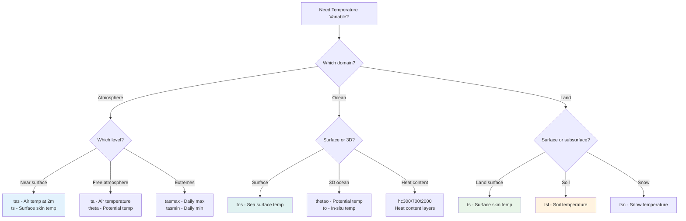
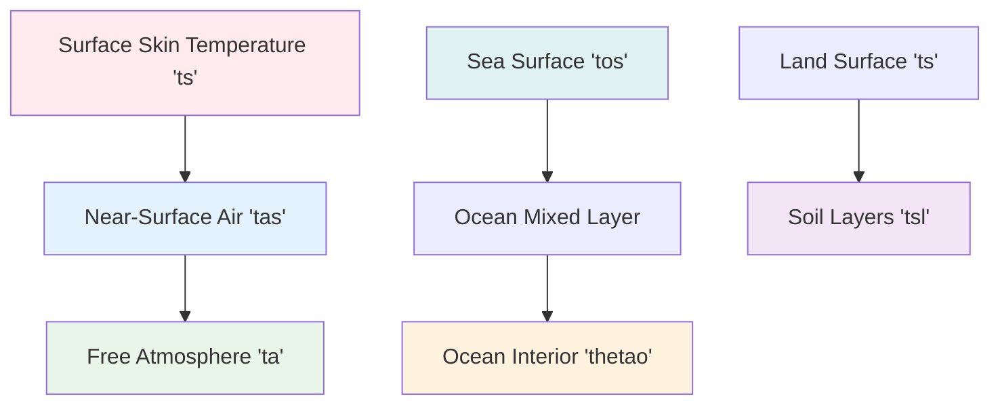

# Temperature & Energy Variables 🌡️

Temperature and energy variables are fundamental to climate science, representing thermal states and energy flows in the Earth system.

[Browse Temperature Variables on GitHub](https://github.com/WCRP-CMIP/Variable-Registry/tree/main/src-data/variable-root){ .md-button .md-button--primary }

## Atmospheric Temperature {#atmospheric}

### Near-Surface Temperature

| Root ID | Full Name | Description | Common Usage |
|---------|-----------|-------------|--------------|
| **`tas`** | Near-Surface Air Temperature | Air temperature ~1.5-2m above surface | Weather stations, climate monitoring |
| **`ts`** | Surface Temperature | Skin temperature of Earth's surface | Satellite observations, energy balance |
| **`tasmax`** | Maximum Near-Surface Air Temperature | Daily maximum air temperature | Heat wave analysis, extremes |
| **`tasmin`** | Minimum Near-Surface Air Temperature | Daily minimum air temperature | Frost analysis, diurnal cycles |

**Example Identifiers**:
```
tas_tavg-h2m-hxy-u      → Monthly mean air temperature at 2m
ts_tavg-u-hxy-u         → Monthly mean surface skin temperature  
tasmax_tmax-h2m-hxy-u   → Daily maximum air temperature
```

### Atmospheric Profile Temperature

| Root ID | Full Name | Description | Common Usage |
|---------|-----------|-------------|--------------|
| **`ta`** | Air Temperature | Temperature in the free atmosphere | Upper-air analysis, model output |
| **`theta`** | Potential Temperature | Temperature adjusted to standard pressure | Atmospheric dynamics, stability |

**Example Identifiers**:
```
ta_tavg-al-hxy-air      → Monthly mean temperature at all levels
ta_tpt-p19-hxy-air      → Instantaneous temperature at standard pressures
```

## Ocean Temperature {#ocean}

### Surface Temperature

| Root ID | Full Name | Description | Common Usage |
|---------|-----------|-------------|--------------|
| **`tos`** | Sea Surface Temperature | Ocean surface temperature | Climate indices, marine ecosystems |
| **`tossq`** | Squared Sea Surface Temperature | SST squared for variance calculations | Climate variability studies |

**Example Identifiers**:
```
tos_tavg-sea-hxy-sea    → Monthly mean sea surface temperature
tos_tavg-u-hxy-sea      → Global monthly mean SST (land masked)
```

### Ocean Profile Temperature  

| Root ID | Full Name | Description | Common Usage |
|---------|-----------|-------------|--------------|
| **`thetao`** | Sea Water Potential Temperature | Pressure-corrected ocean temperature | Ocean modeling, water mass analysis |
| **`to`** | Sea Water Temperature | In-situ ocean temperature | Observational oceanography |
| **`tob`** | Sea Water Potential Temperature at Bottom | Bottom water temperature | Deep ocean studies |

**Example Identifiers**:
```
thetao_tavg-ol-hxy-sea  → Monthly mean potential temp (all depths)
thetao_tavg-d100m-hxy-sea → Monthly mean potential temp at 100m
```

### Ocean Heat Content

| Root ID | Full Name | Description | Common Usage |
|---------|-----------|-------------|--------------|
| **`hc300`** | Heat Content in Upper 300m | Integrated heat in upper ocean | Ocean heat storage, El Niño |
| **`hc700`** | Heat Content in Upper 700m | Integrated heat to 700m depth | Climate change indicators |
| **`hc2000`** | Heat Content in Upper 2000m | Deep ocean heat content | Global warming assessment |

**Example Identifiers**:
```
hc300_tavg-ol-hxy-sea   → Monthly mean upper ocean heat content
```

## Land Temperature {#land}

### Land Surface Temperature

| Root ID | Full Name | Description | Common Usage |
|---------|-----------|-------------|--------------|
| **`tsl`** | Soil Temperature | Temperature in soil layers | Land surface modeling, permafrost |
| **`tsn`** | Snow Temperature | Temperature of snow pack | Snow hydrology, avalanche studies |

**Example Identifiers**:
```
tsl_tavg-sl-hxy-lnd     → Monthly mean soil temperature profile
tsn_tavg-sn-hxy-lnd     → Monthly mean snow temperature
```

## Selection Guide

### Decision Tree



### Common Combinations

**Climate Monitoring**:
```
tas_tavg-h2m-hxy-u      → Standard air temperature
tos_tavg-sea-hxy-sea    → Standard sea surface temperature
```

**Weather Analysis**:
```
ta_tpt-al-hxy-air       → Atmospheric temperature profiles
ts_tavg-u-hxy-u         → Surface temperature analysis
```

**Extremes & Impacts**:
```
tasmax_tmax-h2m-hxy-u   → Heat wave analysis
tasmin_tmin-h2m-hxy-u   → Cold wave, frost analysis
```

**Ocean Studies**:
```
thetao_tavg-ol-hxy-sea  → 3D ocean temperature
hc700_tavg-ol-hxy-sea   → Ocean heat storage
```

## Physical Relationships

### Temperature Scale Relationships



### Vertical Temperature Profiles

**Atmosphere**:
- `ts` → Surface skin temperature (satellite)
- `tas` → 2m air temperature (weather stations) 
- `ta` → Free atmosphere temperature (soundings, models)

**Ocean**:  
- `tos` → Sea surface (~1mm depth)
- `thetao` → Water column (all depths)
- `tob` → Bottom water temperature

**Land**:
- `ts` → Surface skin (satellite, radiative)
- `tsl` → Soil temperature (subsurface layers)

## Units and Standards

### Standard Units
- **Temperature**: Kelvin (K) - absolute temperature scale
- **Heat Content**: Joules (J) or Joules per unit area (J m⁻²)

### CF Standard Names
| Root Variable | CF Standard Name |
|---------------|------------------|
| `tas` | `air_temperature` |
| `tos` | `sea_surface_temperature` |
| `ta` | `air_temperature` |
| `thetao` | `sea_water_potential_temperature` |
| `ts` | `surface_temperature` |

### Typical Value Ranges
| Variable | Global Range | Typical Climate Range |
|----------|--------------|----------------------|
| `tas` | 180-330 K | 250-310 K (-23 to +37°C) |
| `tos` | 271-305 K | 275-303 K (+2 to +30°C) |
| `ta` | 180-330 K | Varies with altitude |
| `ts` | 150-350 K | 200-320 K (extremes) |

## Data Quality Considerations

### Measurement Challenges
- **Spatial representativeness**: Point measurements vs. grid averages
- **Temporal sampling**: Diurnal cycles, seasonal variations
- **Instrument differences**: In-situ vs. satellite vs. reanalysis
- **Surface type effects**: Urban heat islands, land-sea contrasts

### Validation Methods
- **Cross-platform comparison**: Satellite vs. in-situ
- **Model evaluation**: Reanalysis vs. observations
- **Trend analysis**: Long-term consistency checks
- **Physical constraints**: Energy balance relationships

## Common Applications

### Climate Change Detection
```
tas_tavg-u-hxy-u        → Global mean temperature trends
tos_tavg-sea-hxy-sea    → Ocean warming assessment  
hc700_tavg-ol-hxy-sea   → Ocean heat uptake
```

### Weather & Seasonal Forecasting
```
ta_tpt-al-hxy-air       → Atmospheric state initialization
tos_tavg-sea-hxy-sea    → Sea surface boundary conditions
```

### Impact Assessment
```
tasmax_tmax-h2m-hxy-u   → Heat stress, energy demand
tasmin_tmin-h2m-hxy-u   → Agriculture, growing seasons
ts_tavg-u-hxy-u         → Surface energy balance
```

### Process Studies
```
thetao_tavg-ol-hxy-sea  → Ocean circulation, mixing
tsl_tavg-sl-hxy-lnd     → Land-atmosphere coupling
```

## Browse Specific Variables

[Search GitHub for temperature variables](https://github.com/WCRP-CMIP/Variable-Registry/tree/main/src-data/variable-root){ .md-button }

**Quick searches**:
- **Atmospheric**: Look for `tas.json`, `ta.json`, `ts.json`
- **Ocean**: Find `tos.json`, `thetao.json`, `hc*.json`
- **Land**: Search `tsl.json`, `tsn.json`
- **Extremes**: Look for `tasmax.json`, `tasmin.json`

## Navigation

- [← Root Variables Overview](index.md)
- [Water Cycle →](water-cycle.md)
- [Atmospheric Dynamics →](dynamics.md)
- [← Back to Components](../components/index.md)

---

*Temperature variables are fundamental to all climate analysis. Choose based on the specific thermal quantity and spatial domain you need to represent.*