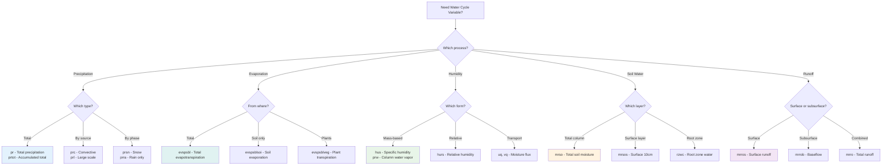
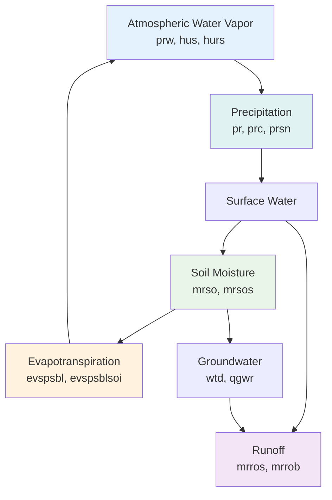

# Water Cycle Variables 🌧️

Water cycle variables represent the movement and storage of water through the Earth system, including precipitation, evaporation, humidity, and soil moisture.

[Browse Water Cycle Variables on GitHub](https://github.com/WCRP-CMIP/Variable-Registry/tree/main/src-data/variable-root){ .md-button .md-button--primary }

## Precipitation {#precipitation}

### Total Precipitation

| Root ID | Full Name | Description | Common Usage |
|---------|-----------|-------------|--------------|
| **`pr`** | Precipitation Rate | Total precipitation (liquid + solid) | Climate monitoring, water resources |
| **`prtot`** | Total Precipitation Amount | Accumulated precipitation over period | Hydrological analysis, extremes |

**Example Identifiers**:
```
pr_tavg-u-hxy-u         → Monthly mean precipitation rate
pr_tsum-u-hxy-u         → Monthly total precipitation amount
pr_tmax-u-hxy-u         → Daily maximum precipitation rate
```

### Precipitation by Type

| Root ID | Full Name | Description | Common Usage |
|---------|-----------|-------------|--------------|
| **`prc`** | Convective Precipitation Rate | Precipitation from convection/thunderstorms | Weather forecasting, extremes |
| **`prl`** | Large Scale Precipitation Rate | Stratiform/large-scale precipitation | Climate modeling, regional studies |
| **`prsn`** | Snowfall Rate | Solid precipitation only | Snow hydrology, winter climate |
| **`prra`** | Rainfall Rate | Liquid precipitation only | Tropical meteorology, flooding |

**Example Identifiers**:
```
prc_tavg-u-hxy-u        → Monthly mean convective precipitation
prsn_tavg-u-hxy-u       → Monthly mean snowfall rate
prra_tmax-u-hxy-u       → Daily maximum rainfall rate
```

### Precipitation Properties

| Root ID | Full Name | Description | Common Usage |
|---------|-----------|-------------|--------------|
| **`prhmax`** | Maximum Hourly Precipitation Rate | Peak hourly precipitation intensity | Flash flood analysis, urban drainage |
| **`pr1h`** | 1-Hour Precipitation Rate | Precipitation rate in 1-hour periods | Weather warnings, infrastructure |
| **`pr3h`** | 3-Hour Precipitation Rate | 3-hourly precipitation accumulation | Operational meteorology |

**Example Identifiers**:
```
prhmax_tmax-u-hxy-u     → Daily maximum hourly precipitation
pr1h_tavg-u-hxy-u       → Mean 1-hour precipitation rates
```

## Evaporation & Humidity {#evaporation}

### Evapotranspiration

| Root ID | Full Name | Description | Common Usage |
|---------|-----------|-------------|--------------|
| **`evspsbl`** | Evaporation Including Sublimation | Total evapotranspiration from surface | Water balance, drought monitoring |
| **`evspsblsoi`** | Water Evaporation from Soil | Bare soil evaporation | Land surface modeling, irrigation |
| **`evspsblveg`** | Evaporation from Canopy | Plant transpiration + canopy evaporation | Ecosystem studies, agriculture |
| **`evspsblpot`** | Potential Evapotranspiration | Atmospheric evaporative demand | Drought indices, irrigation planning |

**Example Identifiers**:
```
evspsbl_tavg-lnd-hxy-u  → Monthly mean total evapotranspiration
evspsblsoi_tavg-lnd-hxy-u → Monthly mean soil evaporation
evspsblpot_tavg-u-hxy-u → Monthly potential evapotranspiration
```

### Atmospheric Humidity

| Root ID | Full Name | Description | Common Usage |
|---------|-----------|-------------|--------------|
| **`hus`** | Specific Humidity | Mass of water vapor per unit mass air | Upper-air analysis, moisture transport |
| **`hurs`** | Relative Humidity | Percentage humidity relative to saturation | Weather analysis, human comfort |
| **`huss`** | Near-Surface Specific Humidity | Specific humidity at ~2m height | Surface meteorology, validation |
| **`prw`** | Precipitable Water | Total atmospheric water vapor column | Weather forecasting, climate monitoring |

**Example Identifiers**:
```
hus_tavg-al-hxy-air     → Monthly mean specific humidity profile
hurs_tavg-h2m-hxy-u     → Monthly mean relative humidity at 2m  
prw_tavg-u-hxy-u        → Monthly mean precipitable water
```

### Water Vapor Transport

| Root ID | Full Name | Description | Common Usage |
|---------|-----------|-------------|--------------|
| **`uq`** | Eastward Water Vapor Flux | Horizontal moisture transport (eastward) | Monsoon studies, moisture budgets |
| **`vq`** | Northward Water Vapor Flux | Horizontal moisture transport (northward) | Atmospheric rivers, water cycle |
| **`wq`** | Upward Water Vapor Flux | Vertical moisture transport | Convection studies, cloud formation |

**Example Identifiers**:
```
uq_tavg-al-hxy-air      → Monthly mean eastward moisture transport
vq_tavg-al-hxy-air      → Monthly mean northward moisture transport
```

## Soil & Hydrology {#hydrology}

### Soil Moisture

| Root ID | Full Name | Description | Common Usage |
|---------|-----------|-------------|--------------|
| **`mrso`** | Total Soil Moisture Content | Total water in entire soil column | Drought monitoring, agriculture |
| **`mrsol`** | Moisture in Upper Portion of Soil Column | Soil moisture in specific layers | Root zone analysis, irrigation |
| **`mrsos`** | Moisture in Upper 10cm of Soil Column | Surface soil moisture | Satellite validation, land-atmosphere coupling |
| **`mrro`** | Total Runoff | Surface + subsurface water flow | River discharge, flood forecasting |

**Example Identifiers**:
```
mrso_tavg-lnd-hxy-u     → Monthly mean total soil moisture
mrsos_tavg-lnd-hxy-u    → Monthly mean surface soil moisture  
mrro_tavg-lnd-hxy-u     → Monthly mean total runoff
```

### Surface Water & Runoff

| Root ID | Full Name | Description | Common Usage |
|---------|-----------|-------------|--------------|
| **`mrros`** | Surface Runoff | Water flow over land surface | Flash flood studies, erosion |
| **`mrrob`** | Subsurface Runoff | Groundwater discharge to rivers | Baseflow analysis, water resources |
| **`rzwc`** | Root Zone Water Content | Water available to plant roots | Crop modeling, ecosystem studies |
| **`tws`** | Terrestrial Water Storage | Total water stored on land | GRACE satellite validation, water cycle |

**Example Identifiers**:
```
mrros_tavg-lnd-hxy-u    → Monthly mean surface runoff
mrrob_tavg-lnd-hxy-u    → Monthly mean subsurface runoff
tws_tavg-lnd-hxy-u      → Monthly mean terrestrial water storage
```

### Groundwater & Deep Hydrology

| Root ID | Full Name | Description | Common Usage |
|---------|-----------|-------------|--------------|
| **`wtd`** | Water Table Depth | Depth to groundwater table | Groundwater studies, well planning |
| **`qgwr`** | Groundwater Recharge Rate | Rate of groundwater replenishment | Water resource management |

**Example Identifiers**:
```
wtd_tavg-lnd-hxy-u      → Monthly mean water table depth
qgwr_tavg-lnd-hxy-u     → Monthly mean groundwater recharge
```

## Selection Guide

### Decision Tree



### Common Applications

**Drought Monitoring**:
```
pr_tavg-u-hxy-u         → Precipitation deficits
evspsblpot_tavg-u-hxy-u → Atmospheric demand
mrso_tavg-lnd-hxy-u     → Soil moisture status
```

**Flood Forecasting**:
```
pr_tmax-u-hxy-u         → Extreme precipitation events
mrros_tavg-lnd-hxy-u    → Surface runoff generation
mrro_tavg-lnd-hxy-u     → Total runoff to rivers
```

**Agricultural Applications**:
```
pr_tsum-u-hxy-u         → Growing season precipitation
evspsbl_tavg-lnd-hxy-u  → Crop water use
mrsos_tavg-lnd-hxy-u    → Surface soil moisture
```

**Climate Studies**:
```
prw_tavg-u-hxy-u        → Atmospheric water vapor trends
hus_tavg-al-hxy-air     → Humidity profile changes
evspsbl_tavg-lnd-hxy-u  → Evapotranspiration changes
```

## Physical Relationships

### Water Cycle Components



### Water Balance Equation

**Surface Water Balance**:
```
P - E - R - ΔS = 0

Where:
P = Precipitation (pr)
E = Evapotranspiration (evspsbl)  
R = Runoff (mrro)
ΔS = Change in soil moisture (mrso)
```

## Units and Standards

### Standard Units
- **Precipitation rates**: kg m⁻² s⁻¹ (equivalent to mm/s)
- **Humidity**: kg kg⁻¹ (specific) or % (relative)
- **Soil moisture**: kg m⁻² (column water equivalent)
- **Precipitable water**: kg m⁻² (column total)

### CF Standard Names
| Root Variable | CF Standard Name |
|---------------|------------------|
| `pr` | `precipitation_flux` |
| `evspsbl` | `water_evapotranspiration_flux` |
| `hus` | `specific_humidity` |
| `mrso` | `soil_moisture_content` |
| `prw` | `atmosphere_mass_content_of_water_vapor` |

### Typical Value Ranges
| Variable | Global Range | Typical Values |
|----------|--------------|----------------|
| `pr` | 0-0.01 kg m⁻² s⁻¹ | 0-300 mm/month |
| `hurs` | 0-100% | 30-90% typical |
| `prw` | 0-80 kg m⁻² | 10-60 mm column |
| `mrso` | 0-1000 kg m⁻² | 100-500 mm |

## Data Quality Considerations

### Measurement Challenges
- **Precipitation**: Gauge undercatch, spatial variability
- **Evaporation**: Direct measurement difficulty, energy balance closure
- **Soil moisture**: Depth representation, spatial heterogeneity  
- **Humidity**: Sensor calibration, temperature dependence

### Validation Methods
- **Water balance closure**: P - E - R - ΔS = 0
- **Energy balance**: Available energy = sensible + latent heat
- **Multi-platform comparison**: Satellite vs. ground observations
- **Model validation**: Process-based evaluation

## Browse Specific Variables

[Search GitHub for water cycle variables](https://github.com/WCRP-CMIP/Variable-Registry/tree/main/src-data/variable-root){ .md-button }

**Quick searches**:
- **Precipitation**: Look for `pr.json`, `prc.json`, `prsn.json`
- **Evaporation**: Find `evspsbl*.json` files
- **Humidity**: Search `hus.json`, `hurs.json`, `prw.json`
- **Soil moisture**: Look for `mrs*.json`, `mrr*.json`

## Navigation  

- [← Temperature & Energy](temperature.md)
- [Atmospheric Dynamics →](dynamics.md)
- [Land & Ecosystems →](land-ecosystems.md)
- [← Root Variables Overview](index.md)

---

*Water cycle variables are essential for understanding hydrological processes, drought, flooding, and water resource management. Choose based on the specific water cycle component and process you need to represent.*