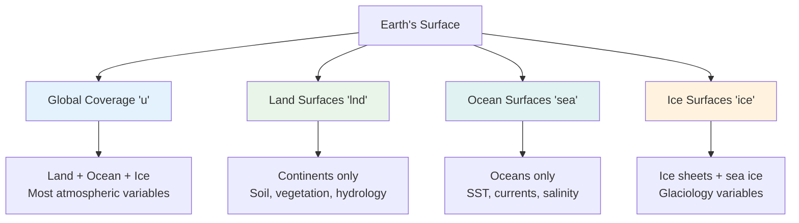
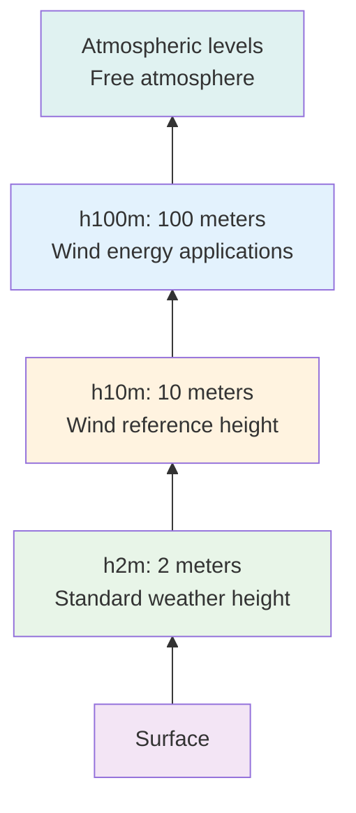
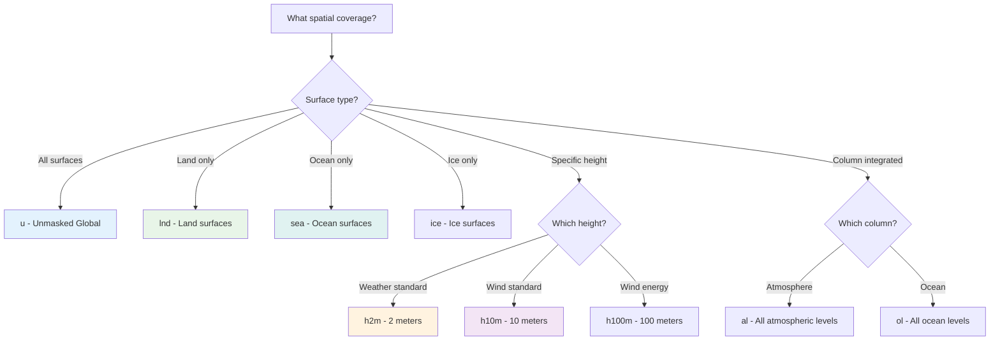

# Area Labels 🗺️

**Area labels** define the spatial coverage or masking applied to variables. They answer the question: *"Where does this variable apply spatially?"*

[Browse Area Labels on GitHub](https://github.com/WCRP-CMIP/Variable-Registry/tree/main/src-data/area-label){ .md-button .md-button--primary }

## Definition

Area labels specify which geographic regions or physical areas a variable covers. They can indicate global coverage, land-only, ocean-only, specific height levels, or other spatial constraints.

## Common Area Labels

### 🌍 **Global Coverage**

| Label ID | Full Name | Description | Usage Examples |
|----------|-----------|-------------|----------------|
| **`u`** | Unmasked | Global coverage (no spatial filtering) | Global climate variables, atmospheric fields |

### 🏔️ **Surface Type Masking**

| Label ID | Full Name | Description | Usage Examples |
|----------|-----------|-------------|----------------|
| **`lnd`** | Land | Land surfaces only | Soil moisture, vegetation, terrestrial ecosystems |
| **`sea`** | Sea/Ocean | Ocean surfaces only | Sea surface temperature, marine variables |
| **`ice`** | Ice | Ice-covered areas only | Ice sheet variables, glacial studies |

### 📏 **Height-Specific Areas**

| Label ID | Full Name | Description | Usage Examples |
|----------|-----------|-------------|----------------|
| **`h2m`** | 2-meter height | 2 meters above surface | Near-surface air temperature, humidity |
| **`h10m`** | 10-meter height | 10 meters above surface | Wind measurements, turbulence studies |
| **`h100m`** | 100-meter height | 100 meters above surface | Wind energy applications |

### 🌊 **Vertical Integration**

| Label ID | Full Name | Description | Usage Examples |
|----------|-----------|-------------|----------------|
| **`al`** | All atmospheric levels | Entire atmospheric column | Column-integrated water vapor, atmospheric mass |
| **`ol`** | All ocean levels | Entire ocean column | Ocean heat content, water mass properties |

## Usage in Branded Identifiers

Area labels are the third component in the identifier construction:

```
[variable-root]_[temporal-label]-[area-label]-[horizontal-label]-[vertical-label]
```

### Examples by Area Coverage

#### Global Variables (`u`)
```
tas_tavg-u-hxy-u       → Global air temperature (land + ocean)
pr_tavg-u-hxy-u        → Global precipitation (land + ocean)  
ps_tavg-u-hxy-u        → Global surface pressure
```

#### Land-Only Variables (`lnd`)
```
mrso_tavg-lnd-hxy-u    → Soil moisture over land only
lai_tavg-lnd-hxy-u     → Leaf area index over land only
gpp_tavg-lnd-hxy-u     → Gross primary productivity over land
```

#### Ocean-Only Variables (`sea`)
```
tos_tavg-sea-hxy-sea   → Sea surface temperature over ocean only
so_tavg-sea-hxy-sea    → Sea water salinity over ocean only
uo_tavg-sea-hxy-sea    → Ocean currents over ocean only
```

#### Height-Specific Variables
```
tas_tavg-h2m-hxy-u     → Air temperature at 2-meter height
sfcWind_tavg-h10m-hxy-u → Wind speed at 10-meter height
hurs_tavg-h2m-hxy-u    → Relative humidity at 2-meter height
```

#### Column-Integrated Variables
```
prw_tavg-al-hxy-u      → Precipitable water (atmospheric column)
intpp_tavg-ol-hxy-sea  → Primary production (ocean column)
```

## Spatial Coverage Concepts

### Coverage Visualization



### Height Reference Levels



## Selection Guidelines

### Decision Tree



### Common Choices by Variable Type

**Atmospheric Variables**:
- **Global fields**: Use `u` for pressure, upper-air variables
- **Near-surface weather**: Use `h2m` for temperature, humidity
- **Wind measurements**: Use `h10m` for standard wind observations
- **Column integrals**: Use `al` for atmospheric water vapor, ozone

**Ocean Variables**:
- **Surface properties**: Use `sea` for SST, surface currents
- **3D ocean fields**: Often use `ol` for full ocean column
- **Global with ocean mask**: Use `sea` to exclude land points

**Land Variables**:
- **Terrestrial processes**: Use `lnd` for soil, vegetation, hydrology
- **Land-atmosphere exchange**: Use `lnd` for fluxes over land
- **Agricultural/ecological**: Use `lnd` for crop, forest variables

**Ice Variables**:
- **Ice sheets**: Use `ice` for land ice variables
- **Sea ice**: Use `ice` for sea ice concentration, thickness

## Physical Consistency Rules

### ✅ Valid Combinations

**Surface type matching**:
```
✓ tos_tavg-sea-hxy-sea   (sea surface temperature over ocean)
✓ mrso_tavg-lnd-hxy-u    (soil moisture over land)
✓ siconc_tavg-ice-hxy-u  (sea ice concentration over ice)
```

**Height-appropriate variables**:
```
✓ tas_tavg-h2m-hxy-u     (air temperature at standard height)
✓ sfcWind_tavg-h10m-hxy-u (wind at standard measurement height)
✓ hurs_tavg-h2m-hxy-u    (humidity at weather station height)
```

**Column integration consistency**:
```
✓ prw_tavg-al-hxy-u      (atmospheric water vapor column)
✓ intpp_tavg-ol-hxy-sea  (ocean primary production column)
```

### ❌ Invalid Combinations

**Surface type mismatches**:
```
❌ tos_tavg-lnd-hxy-u    (sea surface temperature over land)
❌ mrso_tavg-sea-hxy-u   (soil moisture over ocean)
❌ lai_tavg-sea-hxy-u    (leaf area index over ocean)
```

**Unrealistic height combinations**:
```
❌ tos_tavg-h10m-hxy-sea (sea temperature at 10m height in air)
❌ pr_tavg-h100m-hxy-u   (precipitation at 100m height - unrealistic)
```

## Standard Height References

### Meteorological Standards

| Height | Standard Usage | Variables |
|--------|----------------|-----------|
| **2m** | Weather observations | Air temperature, humidity, dew point |
| **10m** | Wind measurements | Wind speed, wind direction |
| **Screen level** | Instrument shelter | Standard meteorological variables |

### Research Applications

| Height | Research Use | Applications |
|--------|--------------|-------------|
| **100m** | Wind energy | Turbine hub height studies |
| **Surface** | Energy balance | Radiation, heat fluxes |
| **Column** | Climate studies | Integrated atmospheric properties |

## Data Processing Implications

### Masking Operations

Area labels determine which grid points are included:

```python
# Pseudocode for area label processing
if area_label == "u":
    # Include all grid points (global)
    mask = all_points
elif area_label == "lnd":
    # Include only land grid points  
    mask = land_sea_mask == "land"
elif area_label == "sea":
    # Include only ocean grid points
    mask = land_sea_mask == "ocean"
elif area_label == "h2m":
    # Extract data at 2-meter height
    data = interpolate_to_height(data, 2.0)
```

### Quality Control Considerations

- **Land/sea boundaries**: Handle coastal grid points appropriately
- **Height interpolation**: Ensure vertical interpolation is physically reasonable
- **Missing data**: Handle areas where mask excludes all data
- **Seasonal variations**: Ice extent changes seasonally

## JSON Structure

Each area label is defined with this structure:

```json
{
    "id": "lnd",
    "validation-key": "lnd",
    "ui-label": "Land Areas",
    "description": "Grid points over land surfaces only, excluding ocean and ice",
    "@context": "_context_",
    "type": ["wcrp:area-label", "variable"]
}
```

## Common Usage Patterns

### Climate Monitoring
- **Global averages**: `*-u-*` for planetary-scale indicators
- **Land climate**: `*-lnd-*` for terrestrial climate impacts
- **Ocean climate**: `*-sea-*` for marine climate indicators

### Weather Services  
- **Standard observations**: `*-h2m-*`, `*-h10m-*` for weather reports
- **Surface analysis**: `*-u-*` for synoptic weather patterns
- **Marine forecasts**: `*-sea-*` for ship and offshore applications

### Impact Studies
- **Agriculture**: `*-lnd-*` for crop-relevant variables
- **Marine ecosystems**: `*-sea-*` for ocean biology
- **Water resources**: `*-lnd-*` for terrestrial hydrology

## Integration Example

Here's how area labels fit into the complete identifier:

```
Root: tas (near-surface air temperature)
Temporal: tavg (time average)
Area: h2m (2-meter height)
Horizontal: hxy (gridded)  
Vertical: u (surface)

Result: tas_tavg-h2m-hxy-u
Meaning: "Near-surface air temperature, time-averaged, 
         at 2-meter height, on regular grid, at surface level"
```

## Browse and Explore

[Browse All Area Labels on GitHub](https://github.com/WCRP-CMIP/Variable-Registry/tree/main/src-data/area-label){ .md-button .md-button--primary }

**Key files to examine**:
- `u.json` - Most common for global atmospheric variables
- `lnd.json` - Essential for terrestrial variables
- `sea.json` - Standard for ocean surface variables
- `h2m.json`, `h10m.json` - Standard meteorological heights

## Navigation

- [← Temporal Labels](temporal-label.md)
- [Horizontal Labels →](horizontal-label.md)
- [← Back to Components](index.md) 
- [Construction Guide](../02-how-to-construct.md)

---

*Area labels define the spatial domain of your variable. Choose based on whether you need global coverage, specific surface types, or particular height levels.*