# Horizontal Labels 📊

**Horizontal labels** define how variables are distributed or represented in the horizontal spatial dimensions. They answer the question: *"How is this variable arranged horizontally across space?"*

[Browse Horizontal Labels on GitHub](https://github.com/WCRP-CMIP/Variable-Registry/tree/main/src-data/horizontal-label){ .md-button .md-button--primary }

## Definition

Horizontal labels specify the horizontal spatial structure of the data - whether it's on a regular grid, along specific transects, as point observations, or other horizontal arrangements.

## Common Horizontal Labels

### 🔲 **Regular Grids**

| Label ID | Full Name | Description | Usage Examples |
|----------|-----------|-------------|----------------|
| **`hxy`** | Gridded Horizontal | Regular latitude-longitude grid | Most climate model output, reanalysis data |

### 📊 **Cross-Sections and Transects**

| Label ID | Full Name | Description | Usage Examples |
|----------|-----------|-------------|----------------|
| **`hys`** | Meridional Section | Latitude-depth or latitude-pressure slice | Ocean circulation studies, atmospheric cross-sections |
| **`hxs`** | Zonal Section | Longitude-depth or longitude-pressure slice | Equatorial ocean studies, zonal wind analysis |
| **`ht`** | Transect | Along specific path or trajectory | Ship tracks, flight paths, satellite tracks |

### 📍 **Point and Station Data**

| Label ID | Full Name | Description | Usage Examples |
|----------|-----------|-------------|----------------|
| **`hpt`** | Point | Single location | Weather stations, buoy observations |
| **`hsite`** | Site | Specific geographic site | Flux towers, research stations |

## Usage in Branded Identifiers

Horizontal labels are the fourth component in the identifier construction:

```
[variable-root]_[temporal-label]-[area-label]-[horizontal-label]-[vertical-label]
```

### Examples by Horizontal Structure

#### Regular Gridded Data (`hxy`)
```
tas_tavg-h2m-hxy-u     → Temperature on regular lat-lon grid
pr_tavg-u-hxy-u        → Precipitation on regular lat-lon grid
tos_tavg-sea-hxy-sea   → Sea surface temperature on regular grid
```

#### Meridional Cross-Sections (`hys`)
```
thetao_tavg-ol-hys-sea → Ocean temperature on latitude-depth section
ua_tavg-al-hys-air     → Eastward wind on latitude-pressure section
so_tavg-ol-hys-sea     → Ocean salinity on meridional section
```

#### Zonal Cross-Sections (`hxs`)
```
thetao_tavg-ol-hxs-sea → Ocean temperature on longitude-depth section  
va_tavg-al-hxs-air     → Northward wind on longitude-pressure section
```

#### Transect Data (`ht`)
```
tos_tpt-sea-ht-sea     → SST along ship track or satellite path
ta_tpt-al-ht-air       → Atmospheric temperature along flight path
```

#### Point Observations (`hpt`)
```
tas_tavg-h2m-hpt-u     → Temperature at weather station
pr_tsum-u-hpt-u        → Daily precipitation total at rain gauge
```

## Horizontal Structure Concepts

### Grid Type Visualization

```mermaid
graph TD
    A[Horizontal Data Structures] --> B[Regular Grids]
    A --> C[Cross-Sections]
    A --> D[Trajectories] 
    A --> E[Point Data]
    
    B --> F[hxy: Lat-Lon Grid<br/>🔲🔲🔲<br/>🔲🔲🔲<br/>🔲🔲🔲]
    
    C --> G[hys: Meridional<br/>Latitude vs Depth<br/>📊]
    C --> H[hxs: Zonal<br/>Longitude vs Depth<br/>📈]
    
    D --> I[ht: Transects<br/>Ship/satellite tracks<br/>➡️➡️➡️]
    
    E --> J[hpt: Point Obs<br/>Weather stations<br/>📍]
    
    style B fill:#e3f2fd
    style C fill:#e8f5e8
    style D fill:#fff3e0
    style E fill:#f3e5f5
```



### Coordinate System Relationships

```mermaid
graph LR
    A[hxy<br/>Full 2D Grid] --> B[Longitude × Latitude]
    C[hys<br/>Meridional] --> D[Latitude × Depth/Pressure]
    E[hxs<br/>Zonal] --> F[Longitude × Depth/Pressure]  
    G[ht<br/>Transect] --> H[Distance along path]
    I[hpt<br/>Point] --> J[Single location]
    
    style A fill:#e3f2fd
    style C fill:#e8f5e8
    style E fill:#fff3e0
    style G fill:#f3e5f5
    style I fill:#ffebee
```



## Selection Guidelines

### Decision Tree


### Common Choices by Data Type

**Climate Model Output**:
- **Standard**: Use `hxy` for regular lat-lon grid output
- **Analysis**: Use `hys` or `hxs` for circulation studies
- **Process studies**: Use `ht` for specific pathway analysis

**Observational Data**:
- **Satellite**: Use `hxy` for gridded products, `ht` for swath data
- **Weather stations**: Use `hpt` for individual stations
- **Research campaigns**: Use `ht` for ship/aircraft tracks
- **Flux towers**: Use `hsite` for ecosystem monitoring sites

**Reanalysis Products**:
- **Standard grids**: Use `hxy` for global regular grids
- **Diagnostic sections**: Use `hys`/`hxs` for circulation analysis

## Physical Applications

### Regular Grids (`hxy`)

**Best for**:
- Global climate analysis
- Weather prediction models
- Satellite-derived gridded products
- Most atmospheric and oceanic modeling

**Typical resolutions**:
- Climate models: 1° × 1° to 0.25° × 0.25°
- Weather models: 0.1° × 0.1° or finer
- Reanalysis: 0.25° × 0.25° to 2.5° × 2.5°

### Meridional Sections (`hys`)

**Best for**:
- Ocean overturning circulation studies
- Atmospheric circulation (Hadley cells)
- Cross-basin ocean transport
- Meridional heat transport analysis

**Typical usage**:
- Atlantic meridional section (26°N, 45°N)
- Pacific circulation studies
- Atmospheric zonal means

### Zonal Sections (`hxs`)

**Best for**:
- Equatorial ocean dynamics
- Zonal wind patterns
- Pacific/Atlantic cross-sections
- Walker circulation studies

**Typical usage**:
- Equatorial Pacific (5°S-5°N average)
- Tropical Atlantic sections
- Monsoon circulation analysis

### Transects (`ht`)

**Best for**:
- Ship-based observations
- Aircraft measurement campaigns  
- Satellite ground tracks
- Specific research transects

**Examples**:
- CalCOFI oceanographic surveys
- Aircraft atmospheric chemistry missions
- Argo float trajectories

### Point Data (`hpt`)

**Best for**:
- Weather station observations
- Buoy measurements
- Individual measurement sites
- Model-observation comparisons

**Applications**:
- Climate monitoring networks
- Validation datasets
- Local impact studies

## Data Structure Implications

### Grid Properties

| Label | Dimensions | Coordinates | Data Structure |
|-------|------------|-------------|----------------|
| `hxy` | 2D grid | lat, lon | `data[lat, lon]` |
| `hys` | 2D section | lat, depth/pressure | `data[lat, level]` |
| `hxs` | 2D section | lon, depth/pressure | `data[lon, level]` |
| `ht` | 1D path | distance/time | `data[position]` |
| `hpt` | 0D point | single location | `data[scalar]` |

### Processing Considerations

**Regular grids** (`hxy`):
- Area weighting for global averages
- Interpolation between grid points
- Map projections and coordinate transformations

**Cross-sections** (`hys`, `hxs`):
- Vertical interpolation to standard levels
- Integration along sections for transports
- Gradient calculations across sections

**Transects** (`ht`):
- Path-following coordinates
- Distance-based analysis
- Temporal sequencing along tracks

**Point data** (`hpt`):
- Quality control for individual observations
- Spatial representativeness considerations
- Aggregation to larger scales

## Physical Consistency Rules

### ✅ Valid Combinations

**Standard grid applications**:
```
✓ tas_tavg-h2m-hxy-u     (surface temperature on regular grid)
✓ tos_tavg-sea-hxy-sea   (SST on regular grid)
✓ pr_tavg-u-hxy-u        (precipitation on regular grid)
```

**Cross-section studies**:
```
✓ thetao_tavg-ol-hys-sea (ocean temperature meridional section)
✓ so_tavg-ol-hxs-sea     (salinity zonal section)
✓ ua_tavg-al-hys-air     (zonal wind meridional section)
```

**Transect observations**:
```
✓ tos_tpt-sea-ht-sea     (SST along ship track)
✓ co2_tpt-h2m-ht-u       (CO2 along aircraft path)
```

### ❌ Invalid Combinations

**Dimensionally inconsistent**:
```
❌ pr_tavg-u-hpt-u       (precipitation at single point - usually use station totals)
❌ global_avg_hxy-*      (global average shouldn't be on a grid)
```

**Physically inappropriate**:
```
❌ tos_tavg-lnd-hxy-u    (sea surface temperature over land)
❌ lai_tavg-sea-hys-u    (leaf area index in ocean section)
```

## JSON Structure

Each horizontal label is defined with this structure:

```json
{
    "id": "hxy",
    "validation-key": "hxy",
    "ui-label": "Gridded Horizontal",
    "description": "Regular latitude-longitude grid with uniform spacing",
    "@context": "_context_", 
    "type": ["wcrp:horizontal-label", "variable"]
}
```

## Common Usage Patterns

### Climate Research
- **Model intercomparison**: `*-hxy-*` for standard grid comparisons
- **Process studies**: `*-hys-*`, `*-hxs-*` for circulation analysis
- **Observational analysis**: `*-hpt-*` for station data, `*-ht-*` for campaigns

### Operational Meteorology
- **Numerical weather prediction**: `*-hxy-*` for model grids
- **Station observations**: `*-hpt-*` for weather networks
- **Satellite products**: `*-hxy-*` for gridded, `*-ht-*` for swaths

### Oceanography
- **Global ocean models**: `*-hxy-*` for basin-scale studies
- **Section studies**: `*-hys-*` for overturning, `*-hxs-*` for equatorial
- **Ship observations**: `*-ht-*` for cruise data, `*-hpt-*` for moorings

## Integration Example

Here's how horizontal labels fit into the complete identifier:

```
Root: tos (sea surface temperature)
Temporal: tavg (time average)
Area: sea (ocean surfaces)
Horizontal: hxy (regular grid)
Vertical: sea (sea surface)

Result: tos_tavg-sea-hxy-sea  
Meaning: "Sea surface temperature, time-averaged, over ocean surfaces,
         on regular lat-lon grid, at sea surface level"
```

## Browse and Explore

[Browse All Horizontal Labels on GitHub](https://github.com/WCRP-CMIP/Variable-Registry/tree/main/src-data/horizontal-label){ .md-button .md-button--primary }

**Key files to examine**:
- `hxy.json` - Most common for climate model output
- `hys.json` - Standard for meridional ocean/atmosphere sections  
- `ht.json` - Essential for observational campaigns
- `hpt.json` - Standard for station observations

## Navigation

- [← Area Labels](area-label.md)
- [Vertical Labels →](vertical-label.md)
- [← Back to Components](index.md)
- [Construction Guide](../02-how-to-construct.md)

---

*Horizontal labels define the spatial structure of your data. Choose based on whether you have gridded data, cross-sections, transects, or point observations.*