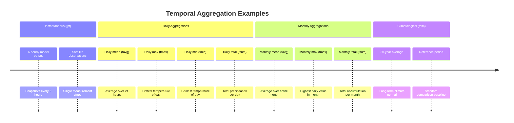
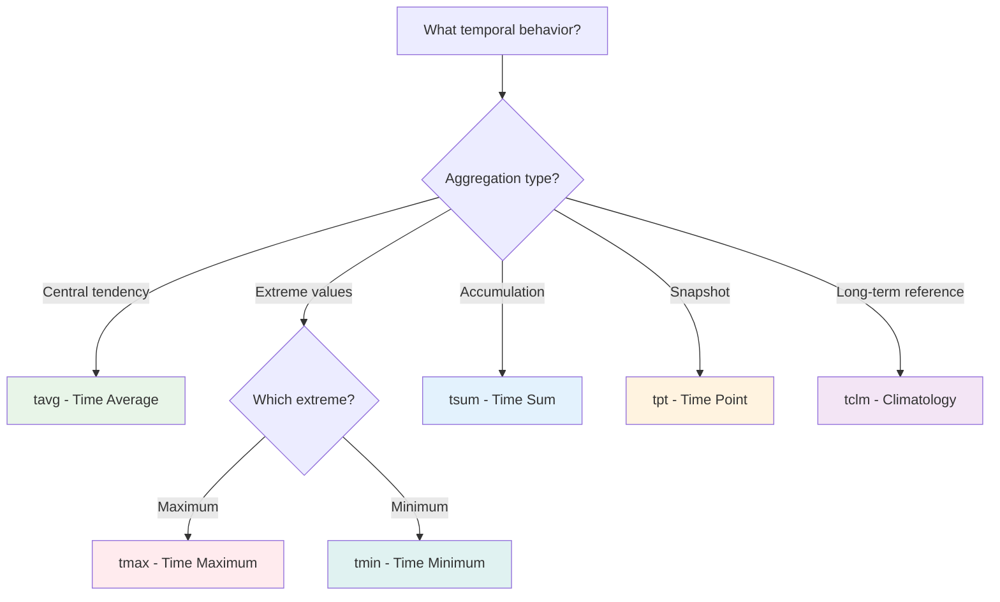

# Temporal Labels ⏰

**Temporal labels** define how variables are sampled, aggregated, or processed in the time dimension. They answer the question: *"How is this variable behaving in time?"*

[Browse Temporal Labels on GitHub](https://github.com/WCRP-CMIP/Variable-Registry/tree/main/src-data/temporal-label){ .md-button .md-button--primary }

## Definition

Temporal labels specify the temporal characteristics of a variable - whether it represents an average over time, an instantaneous snapshot, a maximum/minimum value, or other temporal aggregation methods.

## Common Temporal Labels

| Label ID | Full Name               | Description                              | Usage Examples                                      |
|----------|-------------------------|------------------------------------------|-----------------------------------------------------|
| 📊 **Time Aggregations** |                         |                                          |                                                     |
| `tavg`   | Time Average            | Mean value over the time period          | Monthly mean temperature, annual precipitation      |
| `tmax`   | Time Maximum            | Maximum value in the time period         | Daily temperature maximum, monthly wind peak        |
| `tmin`   | Time Minimum            | Minimum value in the time period         | Daily temperature minimum, drought indices          |
| `tsum`   | Time Sum                | Total accumulated over time period       | Monthly precipitation total, annual carbon flux     |
| ⚡ **Instantaneous Values** |                         |                                          |                                                     |
| `tpt`    | Time Point              | Instantaneous snapshot                    | 6-hourly model output, satellite observations       |
| `tclm`   | Time Climatology        | Long-term average (climatological mean)  | 30-year climate normals, reference periods          |
| 📈 **Statistical Aggregations** |                         |                                          |                                                     |
| `tstd`   | Time Standard Deviation | Variability measure over time            | Climate variability studies, uncertainty analysis   |
| `tvar`   | Time Variance           | Statistical variance over time           | Climate change detection, signal analysis           |


## Usage in Branded Identifiers

Temporal labels are the second component in the identifier construction:

```md
[variable-root]_[**temporal-label**]-[area-label]-[horizontal-label]-[vertical-label]
```

### Examples by Temporal Behavior

#### Time Averages (`tavg`)
```
tas_tavg-h2m-hxy-u     → Monthly mean near-surface air temperature
pr_tavg-u-hxy-u        → Monthly mean precipitation rate  
tos_tavg-u-hxy-sea     → Monthly mean sea surface temperature
```

#### Daily Extremes (`tmax`, `tmin`)
```
tas_tmax-h2m-hxy-u     → Daily maximum air temperature
tas_tmin-h2m-hxy-u     → Daily minimum air temperature
pr_tmax-u-hxy-u        → Daily maximum precipitation rate
```

#### Instantaneous Values (`tpt`)
```
ps_tpt-u-hxy-u         → Instantaneous surface pressure
ua_tpt-al-hxy-air      → Instantaneous eastward wind (all levels)
tos_tpt-u-hxy-sea      → Instantaneous sea surface temperature  
```

#### Time Totals (`tsum`)
```
pr_tsum-u-hxy-u        → Monthly precipitation total
evspsbl_tsum-lnd-hxy-u → Monthly evapotranspiration total
```

## Temporal Processing Concepts


### Time Scales Visualization



## Selection Guidelines

### Decision Tree



## Physical Consistency Rules

### ✅ Valid Combinations

**Intensive variables** (rates, concentrations) work with most temporal labels:
```
✓ tas_tavg-*    (temperature averages make sense)
✓ pr_tmax-*     (peak precipitation rates make sense)  
✓ sfcWind_tmin-* (minimum wind speeds make sense)
```

**Extensive variables** (accumulations, totals) work well with sums:
```
✓ pr_tsum-*     (precipitation totals make physical sense)
✓ evspsbl_tsum-* (evaporation totals are meaningful)
```

### ❌ Problematic Combinations

**Avoid meaningless aggregations**:
```
❌ ps_tsum-*    (pressure "totals" don't make physical sense)
❌ tos_tsum-*   (temperature "totals" are meaningless)
```

**Consider variable nature**:
```
⚠️  pr_tavg-*   (precipitation "averages" - ensure you mean rate, not total)
⚠️  tas_tsum-*  (temperature "sums" are usually not meaningful)
```

## Data Processing Implications

### Temporal Aggregation Methods

| Label | Mathematical Operation | Processing Notes |
|-------|----------------------|------------------|
| `tavg` | `mean(values)` | Simple arithmetic average |
| `tmax` | `max(values)` | Maximum value in period |
| `tmin` | `min(values)` | Minimum value in period |
| `tsum` | `sum(values)` | Total accumulation |
| `tstd` | `std(values)` | Standard deviation |
| `tpt` | `value(t)` | No aggregation - single time |


## Common Usage Patterns

### Climate Data Archives
- **Monthly data**: `*_tavg-*` (monthly means most common)
- **Daily extremes**: `*_tmax-*`, `*_tmin-*` (for impact studies)
- **Reference periods**: `*_tclm-*` (30-year normals)

### Weather Forecasting
- **Model output**: `*_tpt-*` (6-hourly forecasts)
- **Daily summaries**: `*_tavg-*`, `*_tmax-*`, `*_tmin-*`
- **Precipitation**: `*_tsum-*` (daily totals), `*_tmax-*` (peak rates)

### Climate Research
- **Trend analysis**: `*_tavg-*` (annual/seasonal means)
- **Extreme events**: `*_tmax-*`, `*_tmin-*` (threshold exceedances)
- **Variability**: `*_tstd-*`, `*_tvar-*` (climate variability)


## Browse and Explore

[Browse All Temporal Labels on GitHub](https://github.com/WCRP-CMIP/Variable-Registry/tree/main/src-data/temporal-label){ .md-button .md-button--primary }

**Key files to examine**:

 - `tavg.json` - Most commonly used for climate data
 - `tmax.json`, `tmin.json` - Essential for extreme weather analysis  
 - `tpt.json` - Standard for high-frequency model output
 - `tsum.json` - Important for accumulating variables (precipitation, fluxes)

## Navigation

- [← Variable Roots](variable-root.md)
- [Area Labels →](area-label.md)  
- [← Back to Components](index.md)
- [Construction Guide](../02-how-to-construct.md)

---

*Temporal labels define the time-based characteristics of your variable. Choose based on whether you need averages, extremes, totals, or instantaneous values.*