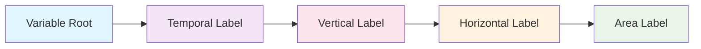

# What is a Branded Identifier?


## Definition

A **Branded Identifier** is a unique, structured name that completely describes a climate variable by combining standardized components into a single, unambiguous identifier that works across all CMIP models.

## Structure

Every branded identifier follows this exact pattern:

```
[root-variable]_[temporal-label]-[vertical-label]-[horizontal-label]-[area-label]
```



## Real CMIP Examples

| Problem Description | Branded Identifier | Complete Meaning |
|-------------------|-------------------|---------|
| "Surface temperature" | `tas_tavg-h2m-hxy-u` | Near-surface air temperature, time-averaged, at 2m height, gridded, unmasked |
| "Ocean temperature" | `tos_tavg-u-hxy-sea` | Sea surface temperature, time-averaged, unspecified vertical, gridded, over sea |
| "Heat flux" | `hfds_tavg-u-hxy-sea` | Downward heat flux, time-averaged, surface, gridded, over sea |

## Example Breakdown: `hfds_tavg-u-hxy-sea`

```
hfds    _tavg  -u    -hxy         -sea
│        │      │     │            │
│        │      │     │            └── Area: Ocean/sea areas only
│        │      │     └────────────── Horizontal: Gridded lat-lon
│        │      └──────────────────── Vertical: Surface/unspecified
│        └─────────────────────────── Temporal: Time average
└──────────────────────────────────── Root: Downward heat flux at sea surface
```

**Result**: *"Downward heat flux at sea surface, time-averaged, at surface level, on a gridded grid, over ocean areas"*

## Interactive Explorer

Build and explore identifiers with the 

[Variable Registry Explorer](../variable-builder.html){ .md-button }.


Try with a complete example: [hfds_tavg-u-hxy-sea](../variable-builder.html?branding=hfds_tavg-u-hxy-sea)

## Key Benefits for CMIP

=== "Scientific Benefits"

    **Eliminates Variable Confusion**
    - No two variables can have the same identifier
    - Clear distinction between similar variables (e.g., air vs. surface temperature)
    - Explicit specification of processing methods

    **Enables Model Comparison**
    - Direct comparison of equivalent variables across models
    - Standardized temporal and spatial processing
    - Consistent physical domains and coordinate systems

=== "Technical Benefits"

    **Machine-Readable**
    - Automated variable matching across models
    - Programmatic validation of variable combinations
    - Standardized data processing workflows

    **Self-Documenting**
    - Variable identifier contains complete metadata
    - No need to guess processing methods or domains
    - Immediate understanding of variable characteristics

=== "Community Benefits"

    **Reduces Scientific Errors**
    - Prevents comparing incompatible variables
    - Eliminates domain mismatches (ocean vs. land)
    - Ensures consistent processing methods

    **Saves Research Time**
    - No more manual variable mapping across models
    - Automated discovery of equivalent variables
    - Standardized analysis workflows


## Registry Scale

The CMIP Variable Registry contains:

- **620+ root variables** across all climate domains
- **Complete component definitions** for temporal, vertical, horizontal, and area labels
- **Validation system** ensuring physical consistency  
- **Machine-readable APIs** for automated access

## Next Steps

1. **[How to construct them →](02_How%20to%20Construct/01_general_structure.md)**
2. **[See examples →](04_root-variables/02_domain_specific_examples/examples.md)**
3. **[Why we need this system →](03-why-we-need-this.md)**

---

*Construction pattern: root_temporal-vertical-horizontal-area*