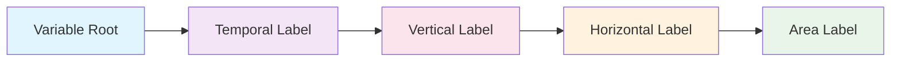

# How to Construct a Branded Identifier

## Role in CMIP Workflows

Constructing branded identifiers is an essential skill for CMIP participation. Every climate variable submitted to CMIP repositories must use this standardized format to ensure:

- **Model intercomparison** across different modeling centers
- **Automated data processing** in CMIP infrastructure  
- **Scientific consistency** in multi-model analyses
- **Quality assurance** through validation systems

Learning this construction method enables seamless integration with CMIP protocols and community standards.

## The Construction Formula

Every branded identifier follows this **exact pattern**:

```
[root-variable]_[temporal-label]-[vertical-label]-[horizontal-label]-[area-label]
```



## Step-by-Step Construction

### Example: Building `hfds_tavg-u-hxy-sea`

**CMIP Scenario**: You need to submit downward heat flux at the sea surface for ocean energy budget studies in CMIP model outputs.

=== "Step 1: Variable Root"

    **Question**: What physical quantity are you measuring?
    
    **Answer**: Downward heat flux at sea surface
    
    **Choice**: `hfds`
    
    **Validation**: Check the [Variable Registry](https://wcrp-cmip.github.io/Variable-Registry/variable-root/) for available root variables

=== "Step 2: Temporal Aggregation"

    **Question**: How is data processed in time?
    
    **Answer**: Time-averaged values (monthly means for CMIP standard output)
    
    **Choice**: `tavg`
    
    **CMIP Context**: Most CMIP analyses require temporally averaged data for climate statistics

=== "Step 3: Vertical Coordinate"

    **Question**: What vertical level or dimension?
    
    **Answer**: Surface level (unspecified vertical dimension for 2D surface flux)
    
    **Choice**: `u`
    
    **Physical Reasoning**: Heat flux occurs at the interface, so no specific vertical coordinate needed

=== "Step 4: Horizontal Representation"

    **Question**: How is data distributed spatially?
    
    **Answer**: Regular latitude-longitude grid (standard CMIP output format)
    
    **Choice**: `hxy`
    
    **CMIP Standard**: Nearly all CMIP output uses gridded horizontal representation

=== "Step 5: Spatial Domain"

    **Question**: What area does this cover?
    
    **Answer**: Sea/ocean areas only (physically meaningful domain for ocean heat flux)
    
    **Choice**: `sea`
    
    **Physical Constraint**: Ocean heat flux only exists over ocean surface

### Assembly Result

```
hfds + _ + tavg + - + u + - + hxy + - + sea = hfds_tavg-u-hxy-sea
```

## Component Selection Guide

=== "Variable Root"

    **Choose the main physical quantity you're measuring**

    | Common Examples | Description |
    |-----------------|-------------|
    | `tas` | Near-surface air temperature |
    | `tos` | Sea surface temperature |
    | `pr` | Precipitation rate |
    | `hfds` | Downward heat flux |
    | `ua`, `va` | Wind components |

    **Resources**: [Browse 620+ root variables](https://github.com/WCRP-CMIP/Variable-Registry/tree/main/src-data/variable-root)

=== "Temporal Labels"

    **How is the data sampled over time?**

    | Label | Description | CMIP Usage |
    |-------|-------------|------------|
    | `tavg` | Time average | Standard for climate statistics |
    | `tmax` | Maximum value | Extreme event analysis |
    | `tmin` | Minimum value | Extreme event analysis |
    | `tpt` | Snapshot/instantaneous | Weather prediction, initial conditions |
    | `tsum` | Sum over time period | Accumulated quantities |

=== "Vertical Labels"

    **What vertical level or dimension?**

    | Label | Description | Typical Use |
    |-------|-------------|-------------|
    | `u` | Surface/unspecified | 2D surface variables |
    | `h2m` | 2 meters above ground | Standard meteorological height |
    | `al` | All atmospheric levels | 3D atmospheric fields |
    | `ol` | All ocean levels | 3D ocean fields |
    | `p19` | CMIP standard pressure levels | Atmospheric analysis |

=== "Horizontal Labels"

    **How is data distributed spatially?**

    | Label | Description | CMIP Standard |
    |-------|-------------|---------------|
    | `hxy` | Regular lat-lon grid | Primary CMIP output format |
    | `hm` | Global mean | Earth system monitoring |
    | `hy` | Zonal mean | Circulation studies |
    | `hys` | Meridional section | Ocean overturning |

=== "Area Labels"

    **What spatial domain/masking?**

    | Label | Description | Physical Domains |
    |-------|-------------|------------------|
    | `u` | Global/unmasked | Atmosphere, precipitation |
    | `sea` | Ocean areas only | Ocean processes |
    | `lnd` | Land areas only | Terrestrial processes |
    | `air` | Atmospheric region | Atmospheric chemistry |
    | `si` | Sea ice regions | Ice processes |

## Validation Framework

### Physical Consistency Checks

**Valid Combinations**:
```
✓ tos_tavg-u-hxy-sea      # Ocean temperature over sea (physical)
✓ tas_tavg-h2m-hxy-u      # Air temperature at 2m height (standard)
✓ mrsol_tavg-sl-hxy-lnd   # Soil moisture in soil layers over land (physical)
```

**Invalid Combinations**:
```
❌ tos_tavg-al-hxy-air     # Sea temperature with atmospheric levels (domain mismatch)
❌ pr_tsum-ol-hxy-sea      # Precipitation at ocean levels (coordinate mismatch)
❌ ps_tsum-u-hxy-u         # Pressure sum (physically meaningless)
```

### CMIP Compliance Checklist

- **Component exists**: All components available in Variable Registry
- **Physical consistency**: Domain and coordinate matching
- **CMIP precedent**: Similar variables exist in CMIP archives
- **Standard format**: Follows exact pattern with correct separators
- **Documentation**: Variable definition available in registry

## Interactive Construction

Use the [Variable Registry Explorer](../../variable-builder.html) to:

- **Build identifiers step-by-step** with guided selection
- **Validate combinations** in real-time  
- **Explore components** with autocomplete functionality
- **View variable details** from live registry data

### Try These Examples

- [hfds_tavg-u-hxy-sea](../../variable-builder.html?branding=hfds_tavg-u-hxy-sea) - Ocean heat flux
- [tas_tavg-h2m-hxy-u](../../variable-builder.html?branding=tas_tavg-h2m-hxy-u) - Air temperature
- [pr_tavg-u-hxy-u](../../variable-builder.html?branding=pr_tavg-u-hxy-u) - Precipitation

## Quality Assurance

### Before Submitting to CMIP

1. **Verify in Variable Registry**: Check if identical variable already exists
2. **Validate physical consistency**: Ensure all components match variable domain
3. **Test with community**: Share identifier with modeling group for feedback
4. **Document thoroughly**: Provide complete variable description and metadata

### Registry Integration

All validated branded identifiers become part of the community registry:

- **Machine-readable definitions** for automated processing
- **Standardized metadata** for documentation
- **Version control** for updates and corrections
- **Community review** for scientific accuracy

## Next Steps

- **[See detailed examples →](../04_root-variables/02_domain_specific_examples/examples.md)**
- **[Learn common patterns →](patterns.md)**
- **[Explore component details →](../05_what_are_the_components/)**
- **[Build identifiers interactively →](../../variable-builder.html)**

---

*Construction follows the pattern: root_temporal-vertical-horizontal-area*